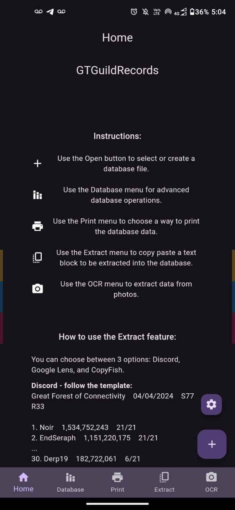
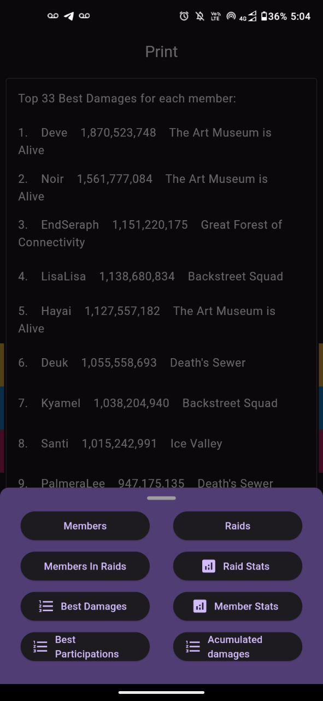

# gt_guild_records_v3

GTGuildRecords is a project aimed at scanning Guardian Tales raid logs and inserting them into a local SQLite3 database. This enables efficient data manipulation for better guild management.

  

Overview

Guardian Tales is a popular mobile game that features various raids where players can team up to defeat powerful enemies. Guilds often participate in these raids, and keeping track of members' participation and performance is crucial for effective guild management. GTGuildRecords automates the process of collecting raid logs and storing them in a database, providing guild leaders with valuable insights into their guild's activities.
Features

    Log Scanning: GTGuildRecords uses OCR to scan Guardian Tales raid logs to extract relevant information such as member participation and damage dealt.
    Database Management: It inserts the extracted data into a local SQLite3 database, allowing for efficient data storage and retrieval.
    Data Manipulation: Guild leaders can use GTGuildRecords to analyze member participation, track performance trends, and make informed decisions to improve guild operations.
    User-Friendly Interface: The project offers a user-friendly interface for easy configuration and monitoring of the scanning process.

Getting Started

To get started with GTGuildRecords, follow these steps:

    Install Dependencies: Ensure you have Flutter installed on your system along with the required libraries listed in the project's pubspec.yalm file. You can install them using flutter pub get library.

    Build Application

    To build the application for different platforms, follow these instructions:
    Android

    To build an Android APK, ensure you have Android Studio installed. Then, open a terminal in the project directory and type:

    flutter build apk --release

    Windows

    To build a Windows executable, ensure you have Visual Studio installed. Then, open a terminal in the project directory and type:

    flutter build windows

        Note: You will need the "Desktop development with C++" workload installed in Visual Studio to build for Windows.

    Additional Platforms

    You can also build the application for other platforms such as macOS, iOS, Linux, or Web. However, please note that these platforms have not been tested.

    macOS:

    flutter build macos

    iOS:

    sh

    flutter build ios

        Note: Building for iOS requires a Mac with Xcode installed.

    Linux:

    flutter build linux

    Web:

    flutter build web

    For detailed instructions on setting up your environment and building for different platforms, please refer to the Flutter documentation.

Contributing

Contributions to GTGuildRecords are welcome! If you have any ideas for improvements or new features, feel free to open an issue or submit a pull request on GitHub.
License

GTGuildRecords is licensed under the GNU Geberal Public v3.0 License (GPL v3.0).

Contact

For any inquiries or support, please contact [Lucas Camelo] at [lucasdosanjoscamelo@gamil.com].
